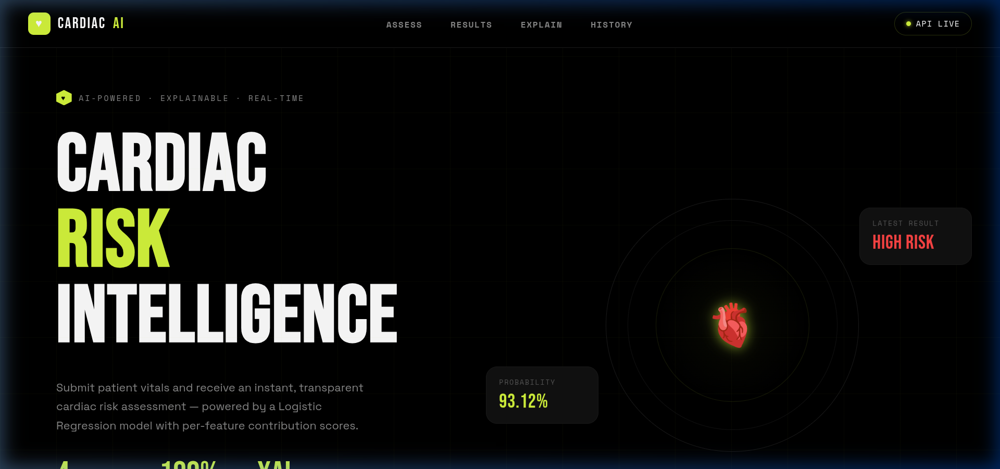
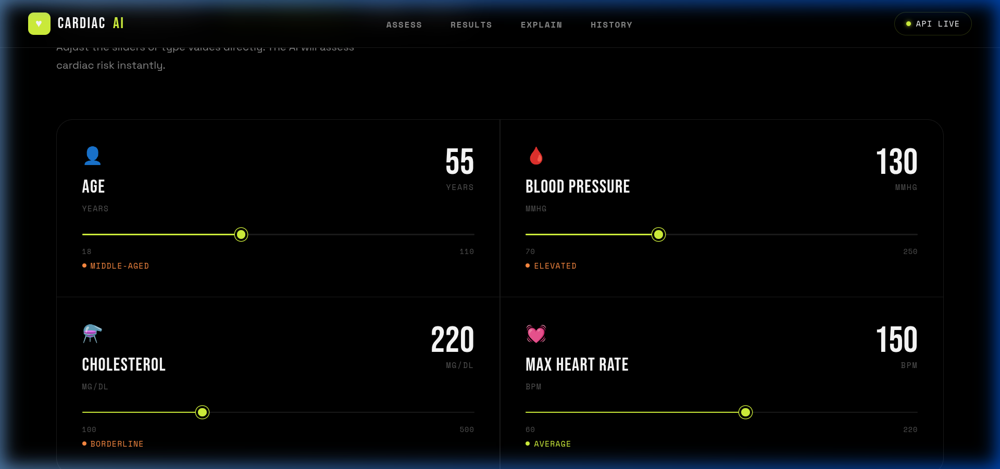
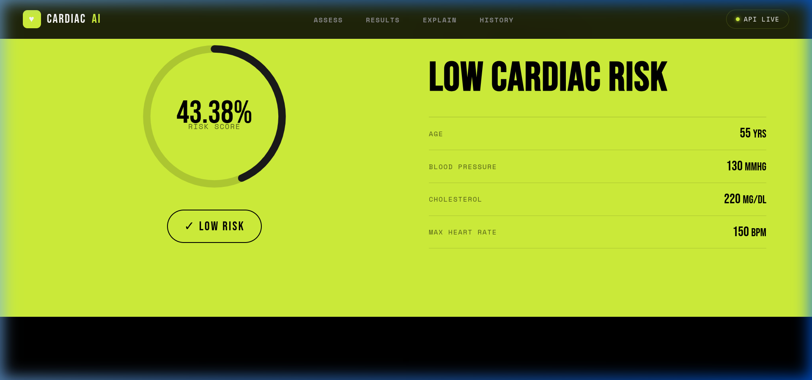
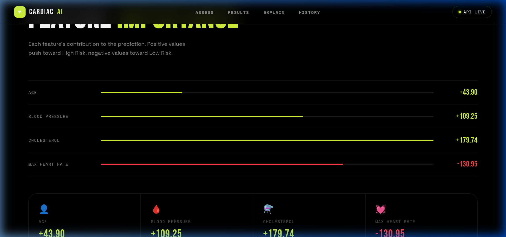

# 🫀 Explainable Cardiac Risk AI & Diagnostic API

[](https://explainable-cardiac-risk-app.onrender.com/)
[](https://fastapi.tiangolo.com/)
[](https://reactjs.org/)
[](https://vitejs.dev/)
[](https://scikit-learn.org/)

An end-to-end, production-grade **Explainable AI (XAI)** web application and **FastAPI** backend that predicts **cardiac risk** from patient vitals and provides transparent, coefficient-based explainability scores for every prediction.

🌐 **Live Deployed App**: [https://explainable-cardiac-risk-app.onrender.com/](https://explainable-cardiac-risk-app.onrender.com/)

---

## 📸 Screenshots & UI Showcase

### ⚡ 1. Hero & Real-Time Live Status


### 🎛 2. Interactive Assessment Calculator
*Input patient vitals (Age, Blood Pressure, Cholesterol, Max Heart Rate) using calibrated sliders or numeric controls:*


### 📊 3. Real-Time Risk Classification & Gauge
*Instant inference with calibrated risk probability and vital breakdown:*


### 🔍 4. Explainable AI Feature Importance
*Transparent coefficient-weighted contribution scores showing exactly why the AI reached its diagnostic prediction:*


---

## ✨ Features

- **Explainable AI (XAI)**: Generates per-feature contribution scores for every prediction, showing positive (risk-increasing) and negative (protective) impacts.
- **Modern High-Contrast Interface**: Inspired by high-end design systems with electric lime accents, stark dark mode, and responsive layout.
- **RESTful CRUD Diagnostics Engine**:
  - `POST` /diagnostics/ — Run AI inference & save diagnostic record
  - `GET` /diagnostics/ — Retrieve past diagnostic records
  - `GET` /diagnostics/{id} — Retrieve individual record details
  - `PUT` /diagnostics/{id} — Update verified clinical outcomes
  - `DELETE` /diagnostics/{id} — Delete record (GDPR/HIPAA compliance)
  - `GET` /health — Liveness & ML model status probe
- **Self-Contained Full-Stack Deployment**: FastAPI serves both REST API endpoints and the compiled React SPA from a single instance.

---

## 🏗 Project Architecture

```
Explainable_Health_Diagnostic_API/
├── main.py                     # FastAPI application entry point & static SPA mount
├── requirements.txt            # Python dependencies (FastAPI, Scikit-learn, etc.)
├── render.yaml                 # Render Blueprint configuration for 1-click deploy
├── render-build.sh             # Build script for Python dependencies + Frontend build
│
├── data/                       # Clinical Datasets
│   └── heart_disease.csv       # UCI / Kaggle Cleveland real patient dataset (303 rows)
│
├── notebooks/                  # Model Research & Validation
│   └── cardiac_risk_model_selection.ipynb  # EDA, model benchmarks, & GridSearch CV
│
├── backend/                    # Core Application Layer
│   ├── schemas.py              # Pydantic request/response models
│   ├── database.py             # Thread-safe in-memory CRUD store
│   ├── model_loader.py         # ML model lifecycle & memory caching
│   ├── services.py             # Inference + Explainability math engine
│   └── routes.py               # REST API route handlers
│
├── model/                      # ML Model Layer
│   ├── train.py                # Pipeline training & artifact serialization
│   └── artifacts/              # Serialized pipeline & evaluation metrics
│       ├── cardiac_model.joblib
│       └── training_metrics.json
│
├── frontend/                   # React + Vite Client
│   ├── src/                    # Components (Hero, Calculator, Results, Explainability)
│   └── package.json            # Node.js dependencies
│
└── docs/                       # Project Documentation & Assets
    └── images/                 # High-resolution screenshots
```

---

## 🚀 Quick Start (Local Development)

### 1. Clone & Setup Backend
```bash
git clone https://github.com/mhd-sajad/Explainable-Health-Diagnostic-API.git
cd Explainable-Health-Diagnostic-API

# Install Python requirements
pip install -r requirements.txt

# Train the ML model
python model/train.py

# Start FastAPI server
uvicorn main:app --reload
```

### 2. Run Frontend
```bash
cd frontend
npm install
npm run dev
```

- Web UI: `http://localhost:5173`
- API Swagger Docs: `http://localhost:8000/docs`
- ReDoc: `http://localhost:8000/redoc`

---

## ☁️ Deployment on Render

This repository includes a [`render.yaml`](render.yaml) blueprint:

1. Go to [Render Blueprints](https://dashboard.render.com/select-repo?type=blueprint).
2. Connect `mhd-sajad/Explainable-Health-Diagnostic-API`.
3. Click **Apply** to deploy both the API and Web UI on a free web service instance!

---

## 🔬 ML Model & Explainability Details

- **Algorithm**: Logistic Regression wrapped in a `scikit-learn` Pipeline with `StandardScaler`.
- **Features**:
  - `age`: Patient age in years
  - `blood_pressure`: Resting blood pressure (mmHg)
  - `cholesterol`: Serum cholesterol level (mg/dL)
  - `max_heart_rate`: Maximum heart rate achieved (bpm)
- **Explainability**:
  $$\text{Contribution}_i = \beta_i \times \frac{x_i - \mu_i}{\sigma_i}$$
  Positive contributions push the prediction toward High Risk, while negative values push toward Low Risk.

---

## 📄 License

MIT License — Created by [Muhammed Sajad](https://github.com/mhd-sajad).
